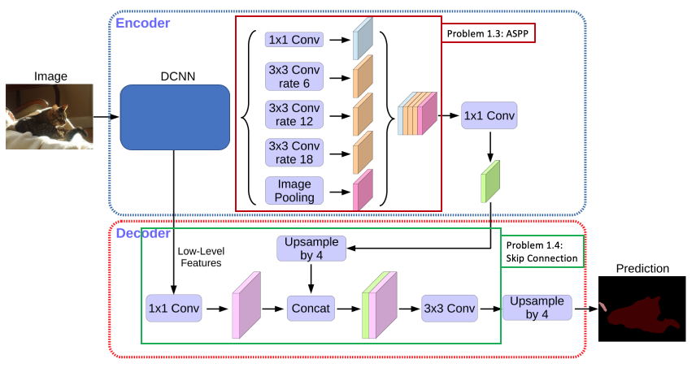
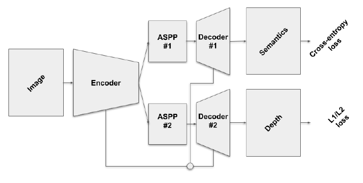
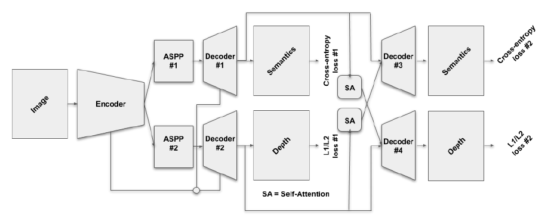

# Multi-Task Learning for Semantic Segmentation and Monocular Depth Estimation
The repository dedicated for the second project of the Deep Learning for Autonomous Driving course at ETH Zürich.

The aim of the project is to build Multi-Task Learning (MTL) architecture for jointly perform semantic segmentation (i.e. the task of associating each pixel of an image with a class label, e.g. person, road, car, etc.) and monocular depth estimation (i.e. the task of estimating the per-pixel depth of a scene from a single image).

Please note that due to code and dataset sharing restrictions imposed, the repository does not contain any code or dataset, rather [project task information](project/Ex02_DLAD.pdf) and [our report](report.pdf) how we completed the tasks at hand.

    

### Tasks
#### **Problem 1: Joint Architecture**
- Hyperparameter Tuning:
  - Optimizer choice, learning rate, batch size and task weighting
- Hardcoded Hyperparameters:
 - Initialization of ImageNet weights
 - Dilated convolutions
- Implementing ASPP Module
- Implementing Decoder stage with Skip Connections

    
    <em>Detailed diagram for Task 1.3 and 1.4.</em>

#### **Problem 2: Branched architecture**
- Implementing the branched architecture demonstrated in the figure below.

In this architecture, encoder is used for both tasks but task-oriented ASPP modules and decoders implemented for semantic segmentation and monocular depth estimation respectively.

    
    <em>Detailed diagram for Task 1.3 and 1.4.</em>

#### **Problem 3: Task Distillation**
- Extending branched architecture with task distillation using attention modules to leverage initial task predictions to distill information across tasks.

    
    <em>Branched architecture with task distillation.</em>

### License
Usage of the information in this repository is strictly prohibited.

### Credits
This is a joint work including me and my project partner Adrian Hoffmann.  
